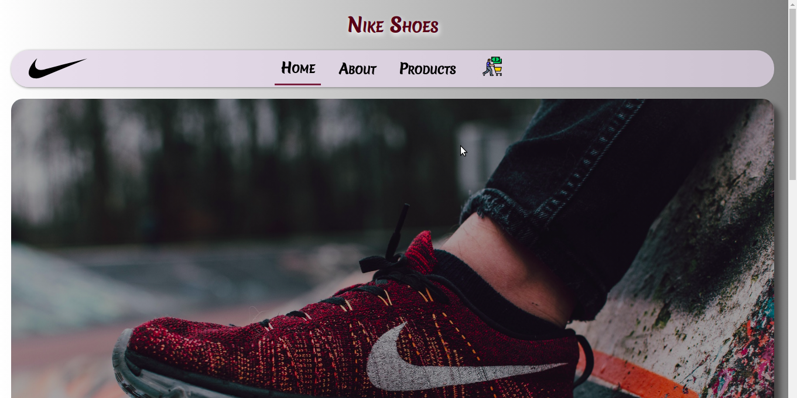

# Nike Shoe Store Website

### *Shoe Showcasing Website for Nike template, I Developed for Practicing purpose.*

# HOMEPAGE

### :link:link : https://nike-shoe-store.netlify.app/

## Features

- View Products
- Add products to cart
- Delete products from cart
- Form Validation
- Accessibility Optimized
- Mobile Responsive

## Run Locally 

- Run this command `git clone https://github.com/Preetiraj3697/Nike-shoes-Store.git`
- You are now in the dev environment and you can play around 

## Tech Stack

- HTML5
- CSS3
- Javascript ES6
- React js
- Material UI
- Redux
- React-Redux
- Redux-Toolkit
- Context API
- Formik
- Yup
- react-horizontal-stepper (for stepper)
- Netlify
- Github Actions
